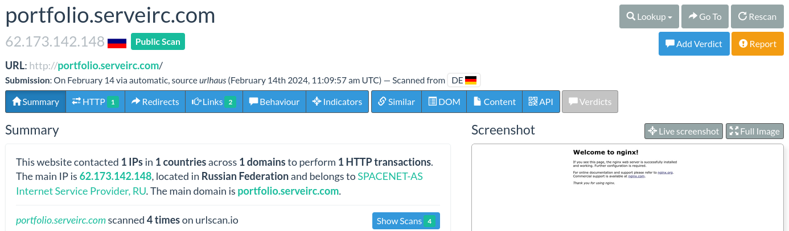

# [Danabot](https://cyberdefenders.org/blueteam-ctf-challenges/danabot/)

## Scenario

The SOC team has detected suspicious activity in the network traffic, revealing that a machine has been compromised. Sensitive company information has been stolen. Your task is to use Network Capture (PCAP) files and Threat Intelligence to investigate the incident and determine how the breach occurred.

## Questions

1. Which IP address was used by the attacker during the initial access?
1. What is the name of the malicious file used for initial access?
1. What is the SHA-256 hash of the malicious file used for initial access?
1. Which process was used to execute the malicious file?
1. What is the file extension of the second malicious file utilized by the attacker?
1. What is the MD5 hash of the second malicious file?

## Analysis

We are provided with a file **205-DanaBot.pcap** with the hash value of `d7624c8b2c987abb196ee8eddc8da93b19bbc51abbf0aaa002d56e088915b512`, which seems to be a Packet Capture file. We can probably use Wireshark or Tshark do review the contents.

Since Wireshark is more user-friendly, for purposes of this report we are going to run it via: 
```
$ wireshark 205-DanaBot.pcap
``` 

At the first glance we can determine that the packet capture was run on a device that had the IP address `10.2.14.101`, since that address appears both as a Source Address and a Destination Address. Going through the packets without any specific plan in mind I've noticed some additional hints that could help me further in the investigation:

1. The machine in question queries its DNS server (`10.2.14.1`) for various domains like:
    * `ipv6.msftconnecttest.com: type A, class IN`
    * `v10.events.data.microsoft.com: type A, class IN`
    * `dns.msftncsi.com: type AAAA, class IN`
    * `smartscreen.microsoft.com: type A, class IN`
    which are domains beloning to Microsoft. The machine in question is a Windows machine.
1. The first packet is a DNS query to `portfolio.serveirc.com: type A, class IN` which is interesting.
1. Later the `soundata.top: type A, class IN` is queried which is also interesting.
1. There is a download session with `188.114.97.3` via `80/tcp`
1. There is some encrypted communication with `195.133.88.98` via `443/tcp` (SSLv2)
1. I've found NetBIOS communication with some information about the source machine `DESKTOP-UR3S9N8<20>: type NB, class IN`. We got it's hostname.
1. There is a `GET /connecttest.txt` to `23.10.249.35` via `80/tcp`, but that looks legit (Microsoft services)

### Initial Access

We can look at some interesting stuff we have found, starting with: `portfolio.serveirc.com`. The machine does a **HTTP GET /login.php HTTP/1.1** request. Let's do some research.

I'm going to use virustotal.com, and perhaps urlscan.io.


It is malicious. Let's if we can find how did the `portfolio.serveirc[.]com/login.php` look like. This is our first malicious service, and probably the initial access we are being asked about.



At the time of writing this report, it looks like the domain resolves to a Russian nginx instance on `62.173.142.148`, but there is no clear service. Which is also present in our `.pcap` file. However the machine gets a 200 OK with an interesting response. Looks like an obfuscated JavaScript file.
```http
HTTP/1.1 200 OK
Server: nginx/1.14.0 (Ubuntu)
Date: Wed, 14 Feb 2024 16:25:54 GMT
Content-Type: application/octet-stream
Transfer-Encoding: chunked
Connection: keep-alive
Content-disposition: attachment;filename=allegato_708.js
```
```js
function _0x23c2(){var _0xac67d2=['a8k3odVdVaBcHh/dUmoMWRBdK8kS','W6XeW43cPJWvWQ/cGhykW5FcQ3O','WOa1eupdOSkXWROVjCoMbLldTNq','WQWlk2mA','j8ocW6xcJ0hdNCoJW4RcPsRdVmo6kW','pmk+dmk5W6qEW67dOMi','ECo8WPZdNmojb37dQSoLe8kIja','tm'
..."<truncated for security reasons>"
```

Let's get the hash of this malicious script, since we are being asked for that in the questions. I've looked this up since I tried saving the javascript to a file and then doing `sha256sum` but that's not the hash that is correct in the question. 

What we needed to do is to go back to Wireshark, select **File** > **Export objects** > **HTTP** > and then select the `login.php` content that was downloaded and then **Save**.

Then the hash from `sha256sum` and answer to the question value was correct.

### Obfuscated script

We can to try to deobfuscate the script. For this we will use https://deobfuscate.relative.im/. We can try to also make this script more readable for other analysts, since the variable names are not clear.

Before:


After:


Now it's more readable. The script generates a random DLL filename and downloads a malicious DLL from a remote domain (`soundata[.]top`). It saves the DLL to a temporary folder and executes it using rundll32.exe. After execution it deletes itself. This to me looks like a common malware dropper.

Lets if we can get the DLL file from the `.pcap` file. There is evidence that the machine has executed the malicious JavaScript file. The malicious domain has been resolved to:
```
soundata.top: type A, class IN, addr 188.114.97.3
```

So we should look for a session to destination `188.114.97.3`. 

The connection is not encrypted. That means we can try to get the contents of the malicious library being downloaded. We can identify an executable by the first bytes of the payload `MZ`, which is `4d 5a` in hex.


We can also get the file using the Export objects functionality in Wireshark as mentioned above.

The hashes we got for this `resources.dll` file are: `2597322a49a6252445ca4c8d713320b238113b3b8fd8a2d6fc1088a5934cee0e`, and the MD5 checksum is `e758e07113016aca55d9eda2b0ffeebe`


## Answers

1. Which IP address was used by the attacker during the initial access?
    > 62.173.142.148
1. What is the name of the malicious file used for initial access?
    > allegato_708.js
1. What is the SHA-256 hash of the malicious file used for initial access?
    > 847b4ad90b1daba2d9117a8e05776f3f902dda593fb1252289538acf476c4268
1. Which process was used to execute the malicious file?
    > WScript.exe
1. What is the file extension of the second malicious file utilized by the attacker?
    > .dll
1. What is the MD5 hash of the second malicious file?
    > e758e07113016aca55d9eda2b0ffeebe

## Resources used

* https://deobfuscate.relative.im/
* https://urlscan.io/result/56dd29ec-e0e0-4207-b34e-d4ca7edb0763/#summary
* https://www.filescan.io/uploads/684730c4985349514e619a09/reports/11edfd69-8184-4666-af93-47f8de76bc79/overview
* https://www.virustotal.com/gui/file/2597322a49a6252445ca4c8d713320b238113b3b8fd8a2d6fc1088a5934cee0e/detection