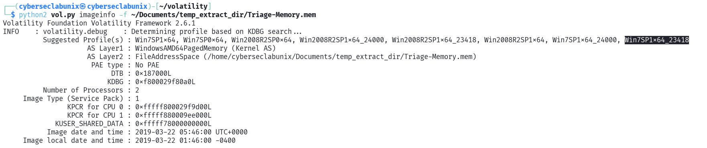
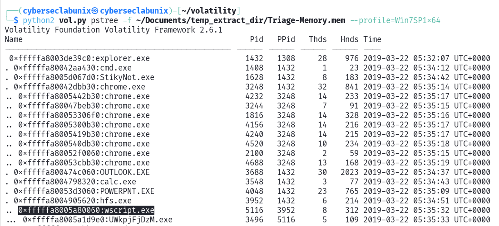
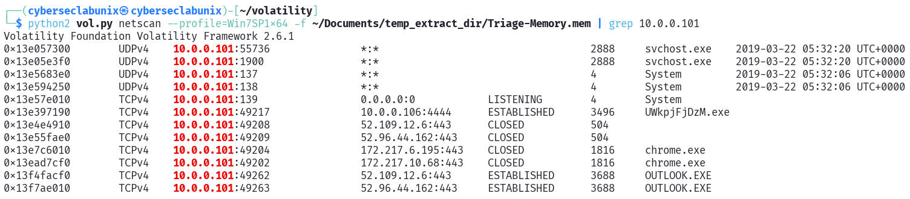
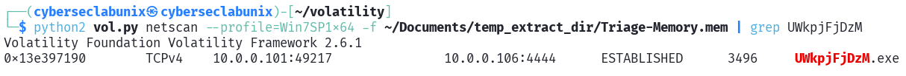
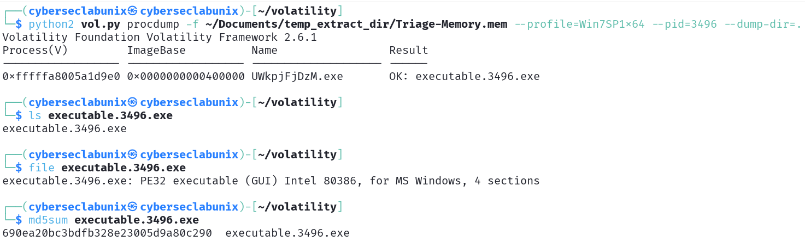
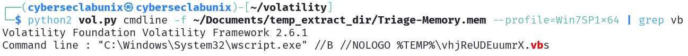
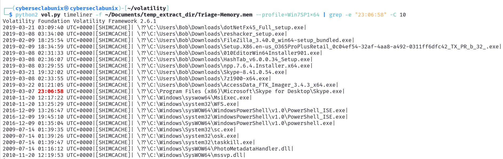
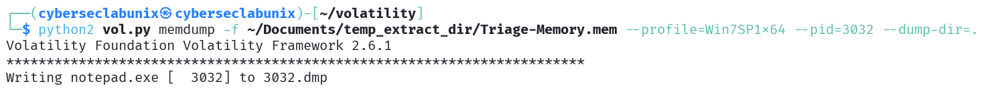
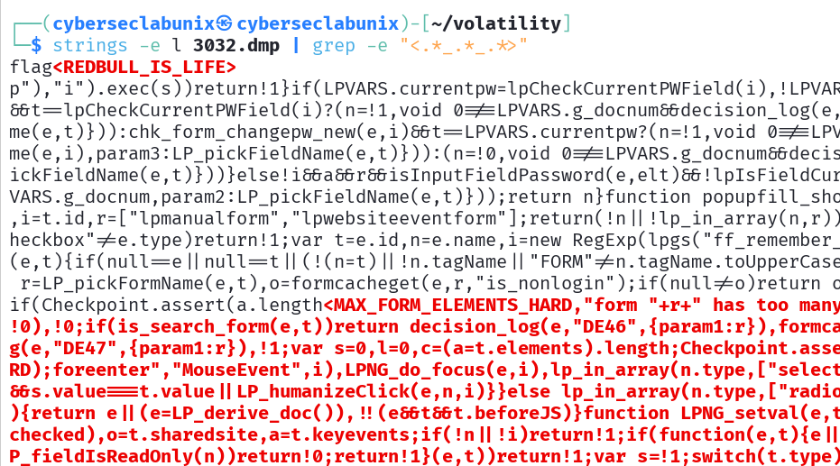
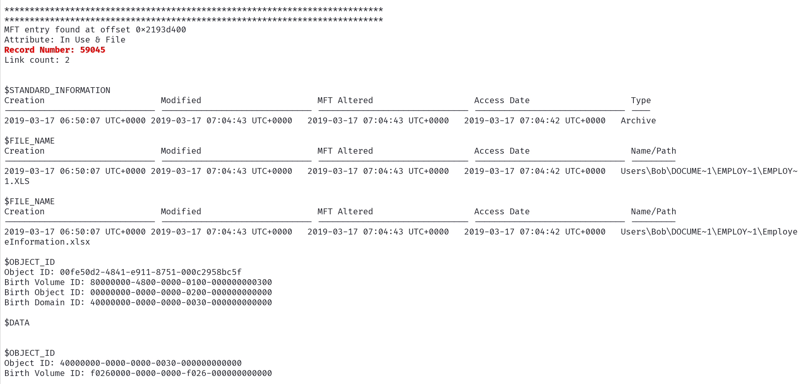

# [DumpMe](https://cyberdefenders.org/blueteam-ctf-challenges/dumpme/)

## Scenario

A SOC analyst took a memory dump from a machine infected with a meterpreter malware. As a Digital Forensicators, your job is to analyze the dump, extract the available indicators of compromise (IOCs) and answer the provided questions.

## Questions

1. [What is the SHA1 hash of Triage-Memory.mem (memory dump)?](#1-what-is-the-sha1-hash-of-triage-memorymem-memory-dump)
1. [What volatility profile is the most appropriate for this machine? (ex: Win10x86_14393)](#2-what-volatility-profile-is-the-most-appropriate-for-this-machine-ex-win10x86_14393)
1. [What was the process ID of notepad.exe?](#3-what-was-the-process-id-of-notepadexe)
1. [Name the child process of wscript.exe?](#4-name-the-child-process-of-wscriptexe)
1. [What was the IP address of the machine at the time the RAM dump was created?](#5-what-was-the-ip-address-of-the-machine-at-the-time-the-ram-dump-was-created)
1. [Based on the answer regarding the infected PID, can you determine the IP of the attacker?](#6-based-on-the-answer-regarding-the-infected-pid-can-you-determine-the-ip-of-the-attacker)
1. [How many processes are associated with VCRUNTIME140.dll?](#7-how-many-processes-are-associated-with-vcruntime140dll)
1. [After dumping the infected process, what is its md5 hash?](#8-after-dumping-the-infected-process-what-is-its-md5-hash)
1. [What is the LM hash of Bob's account?](#9-what-is-the-lm-hash-of-bobs-account)
1. [What memory protection constants does the VAD node at 0xfffffa800577ba10 have?](#10-what-memory-protection-constants-does-the-vad-node-at-0xfffffa800577ba10-have)
1. [What memory protection did the VAD starting at 0x00000000033c0000 and ending at 0x00000000033dffff have?](#11-what-memory-protection-did-the-vad-starting-at-0x00000000033c0000-and-ending-at-0x00000000033dffff-have)
1. [There was a VBS script that ran on the machine. What is the name of the script? (submit without file extension)](#12-there-was-a-vbs-script-that-ran-on-the-machine-what-is-the-name-of-the-script-submit-without-file-extension)
1. [An application was run at 2019-03-07 23:06:58 UTC. What is the name of the program? (Include extension)](#13-an-application-was-run-at-2019-03-07-230658-utc-what-is-the-name-of-the-program-include-extension)
1. [What was written in notepad.exe at the time when the memory dump was captured?](#14-what-was-written-in-notepadexe-at-the-time-when-the-memory-dump-was-captured)
1. [What is the short name of the file at file record 59045?](#15-what-is-the-short-name-of-the-file-at-file-record-59045)
1. [This box was exploited and is running meterpreter. What was the infected PID?](#16-this-box-was-exploited-and-is-running-meterpreter-what-was-the-infected-pid)

## Analysis

We are provided with a MEM file called `Triage-Memory.mem`. In the first question we are asked to provide the SHA1 hash of this file.

### 1. What is the SHA1 hash of Triage-Memory.mem (memory dump)?

We can use the `sha1sum` tool to calculate the hash of the file. The tool returns the value described below:

```
┌──(cyberseclabunix㉿cyberseclabunix)-[~/Documents/temp_extract_dir]
└─$ sha1sum Triage-Memory.mem 

c95e8cc8c946f95a109ea8e47a6800de10a27abd  Triage-Memory.mem
```

### 2. What volatility profile is the most appropriate for this machine? (ex: Win10x86_14393)

We need to find out the most appropriate volatility profile. Since there has been a mention of meterpreter usage, we can consider running a `windows.info` module in `volatility`.

In Volatility 2 there is a module called `imageinfo` we can use to determine the answer to this question.



We take the first value from the left and it seems to be the correct answer: "Win7SP1x64".

### 3. What was the process ID of notepad.exe?

The process can be looked up via the `pslist` module. Since we know that profile to use, we will specify it as well using `--profile=Win7SP1x64`. 

```
┌──(cyberseclabunix㉿cyberseclabunix)-[~/volatility]
└─$ python2 vol.py pslist -f ~/Documents/temp_extract_dir/Triage-Memory.mem --profile=Win7SP1x64 | grep notepad

Volatility Foundation Volatility Framework 2.6.1
0xfffffa80054f9060 notepad.exe            3032   1432      1       60      1      0 2019-03-22 05:32:22 UTC+0000
```

We can determine that the process ID we've been asked to find is `3032`.

### 4. Name the child process of wscript.exe?

Getting the parent and child processes is easy. There is a `pstree` module that will output all processes in a tree format.



From the screenshot we can see that the `wscript.exe` process is a parent to a `UWkpjFjDzM.exe` process, which is at least suspicious looking.

### 5. What was the IP address of the machine at the time the RAM dump was created?

For that question I tried modules `connections`, `connscan` and `sockscan` but all of them are not supported for the Win7SP1 profile. One specific module has worked, `netscan`.

Running the line below has revealed all active connections:

```log
$ python2 vol.py netscan --profile=Win7SP1x64 -f ~/Documents/temp_extract_dir/Triage-Memory.mem
```

We got a lot of entries, and after a quick analysis we can see that one address keeps popping up as the local address: `10.0.0.101`. Windows by default use NetBIOS services running on port 137 using the local IPv4 address that we want.

I'll filter out all other connections via `grep` command.



Looks like this is the answer we were looking for.

### 6. Based on the answer regarding the infected PID, can you determine the IP of the attacker?

All there is to do is to filter this connection list by the infected process name `UWkpjFjDzM.exe`.



Since there is mention of meterpreter usage, it is probably a reverse shell session, where the victim starts the connection to the attacker, that has an open port running. The screenshot above depicts such behavior. The attacker's IP address is `10.0.0.106`.

### 7. How many processes are associated with VCRUNTIME140.dll?

For this question we will focus on modules related to dynamic link libraries (DLLs). For Volatility 2 there are two modules `dlldump` and `dlllist`. We will begin with listing DLLs for that image.

```
$ python2 vol.py dlllist -f ~/Documents/temp_extract_dir/Triage-Memory.mem --profile=Win7SP1x64 | grep VCRUNTIME140

olatility Foundation Volatility Framework 2.6.1
0x000007fefa5c0000            0x16000             0xffff 2019-03-22 05:32:05 UTC+0000   C:\Program Files\Common Files\Microsoft Shared\ClickToRun\VCRUNTIME140.dll
0x00000000745f0000            0x15000             0xffff 2019-03-22 05:33:49 UTC+0000   C:\Program Files (x86)\Microsoft Office\root\Office16\VCRUNTIME140.dll
0x00000000745f0000            0x15000             0xffff 2019-03-22 05:34:37 UTC+0000   C:\Program Files (x86)\Microsoft Office\root\Office16\VCRUNTIME140.dll
0x00000000745f0000            0x15000                0x3 2019-03-22 05:34:49 UTC+0000   C:\Program Files (x86)\Microsoft Office\root\Office16\VCRUNTIME140.dll
0x00000000745f0000            0x15000             0xffff 2019-03-22 05:35:09 UTC+0000   C:\Program Files (x86)\Microsoft Office\root\Office16\VCRUNTIME140.dll
```

Running `dlllist` and `grep` returns 5 entries, which is the answer to our question.

### 8. After dumping the infected process, what is its md5 hash?

The infected process (`UWkpjFjDzM`) has the ID `3496`. We will use `procdump` module to dump the process into an executable. For this module we also need to specify the dump directory via `--dump-dir` parameter. Then we can use `md5sum` to get the MD5 hash of the file.

```
$ python2 vol.py procdump -f ~/Documents/temp_extract_dir/Triage-Memory.mem --profile=Win7SP1x64 --pid=3496 --dump-dir=.
```



We get a MD5 hash value of `690ea20bc3bdfb328e23005d9a80c290`.

### 9. What is the LM hash of Bob's account?

This is where we need to use the `hashdump` module. The LM part of a NTLM hash is the first hex value right before the `:::`.

```
┌──(cyberseclabunix㉿cyberseclabunix)-[~/volatility]
└─$ python2 vol.py hashdump -f ~/Documents/temp_extract_dir/Triage-Memory.mem --profile=Win7SP1x64 

Volatility Foundation Volatility Framework 2.6.1
Administrator:500:aad3b435b51404eeaad3b435b51404ee:31d6cfe0d16ae931b73c59d7e0c089c0:::
Guest:501:aad3b435b51404eeaad3b435b51404ee:31d6cfe0d16ae931b73c59d7e0c089c0:::
Bob:1000:aad3b435b51404eeaad3b435b51404ee:31d6cfe0d16ae931b73c59d7e0c089c0:::
```

The LM value for Bob is `aad3b435b51404eeaad3b435b51404ee`.

### 10. What memory protection constants does the VAD node at 0xfffffa800577ba10 have?

I didn't know what VADs actually were. They are Virtual Address Descriptors. In short, each process has a set of VADs that describe the range of virtual memory address space reserved for that process. More information about VADs you can read in [this Medium article](https://imphash.medium.com/windows-process-internals-a-few-concepts-to-know-before-jumping-on-memory-forensics-part-4-16c47b89e826).

Volatility has a couple of modules that allow us to analyse VADs: `vaddump`, `vadinfo`, `vadtree` and `vadwalk`.

For now, we are just going to use `vadinfo` and grep the `0xfffffa800577ba10` address to get the information we need.

```
$ python2 vol.py vadinfo -f ~/Documents/temp_extract_dir/Triage-Memory.mem --profile=Win7SP1x64 | grep 0xfffffa800577ba10 -A 11

Volatility Foundation Volatility Framework 2.6.1
VAD node @ 0xfffffa800577ba10 Start 0x0000000000030000 End 0x0000000000033fff Tag Vad 
Flags: NoChange: 1, Protection: 1
Protection: PAGE_READONLY
Vad Type: VadNone
ControlArea @fffffa8005687a50 Segment fffff8a000c4f870
NumberOfSectionReferences:          1 NumberOfPfnReferences:           0
NumberOfMappedViews:               29 NumberOfUserReferences:         30
Control Flags: Commit: 1
First prototype PTE: fffff8a000c4f8b8 Last contiguous PTE: fffff8a000c4f8d0
Flags2: Inherit: 1, SecNoChange: 1
```

The protection consants are visible in the output above. It is `PAGE_READONLY`.

### 11. What memory protection did the VAD starting at 0x00000000033c0000 and ending at 0x00000000033dffff have?

We can use the same module for this question, but `grep` needs a little bit of modification.

```
$ python2 vol.py vadinfo -f ~/Documents/temp_extract_dir/Triage-Memory.mem --profile=Win7SP1x64 | grep -e "Start 0x00000000033c0000 End 0x00000000033dffff" -A 15

Volatility Foundation Volatility Framework 2.6.1
VAD node @ 0xfffffa80052652b0 Start 0x00000000033c0000 End 0x00000000033dffff Tag VadS
Flags: CommitCharge: 32, PrivateMemory: 1, Protection: 24
Protection: PAGE_NOACCESS
Vad Type: VadNone
```

The answer is `PAGE_NOACCESS`.

### 12. There was a VBS script that ran on the machine. What is the name of the script? (submit without file extension)

For this one I figured that I can just use the `cmdline` module that returns all processes and their command line parameters. Since VBS script has been executed on this machine, we can look for a `.vb*` extension via `grep`.



```py
"C:\Windows\System32\wscript.exe" //B //NOLOGO %TEMP%\vhjReUDEuumrX.vbs
```

The name of the script is `vhjReUDEuumrX`.

### 13. An application was run at 2019-03-07 23:06:58 UTC. What is the name of the program? (Include extension)

For this specific timestamp we could leverage the `timeliner` module, which collects all timestamps from all behaviours, caches, browser history etc. and displays it in a nice to read format.

This one took a while to process, but the results seem to point to a Skype application.



```
2019-03-07 23:06:58 UTC+0000|[SHIMCACHE]| \??\C:\Program Files (x86)\Microsoft\Skype for Desktop\Skype.exe| 
```

The answer for this question is `Skype.exe`.

### 14. What was written in notepad.exe at the time when the memory dump was captured?

To answer this question we need to dump all memory for this process using a module called `memdump`. 



We are now provided with a memory dump file of the process. This is where I got stuck for a while. So I tried reading the dump file via `cat` and `strings`. It was kind tiresome and useless. So I looked at the hint and the format of the answer which was `****<********_**_****>`. So I've come up with a regex statement, so I can combine `strings` and `grep -e` commands to find that answer. Without the answer format it would be hard to find the exact information in my opinion. Or maybe I'm not smart enough yet. 

Either way I've looked for the strings enclosed in `<` and `>` with two underscores `_`.
```
$ strings -e l 3032.dmp | grep -e "<.*_.*_.*>"
```



Not ideal, but we got the answer: `flag<REDBULL_IS_LIFE>`.

### 15. What is the short name of the file at file record 59045?

Here I think that we can lookup the file records in the Master File Table (MFT). To do a lookup we will use `mftparser` module.

Running `python2 vol.py mftparser -f ~/Documents/temp_extract_dir/Triage-Memory.mem --profile=Win7SP1x64` will output the full MFT. Here we can see the `Record Number: xxxxx` property with every entry. We can filter that with `grep` command to find the file. I'm using `-C 30` to give us some additional context for `grep`.

```
$ python2 vol.py mftparser -f ~/Documents/temp_extract_dir/Triage-Memory.mem --profile=Win7SP1x64 | grep "Record Number: 59045" -C 30
```



The name of the file record 59045 is: `EMPLOY~1.XLS`

### 16. This box was exploited and is running meterpreter. What was the infected PID?

Here we just need to pull up the answer from [question 8](#8-after-dumping-the-infected-process-what-is-its-md5-hash).

> The infected process (`UWkpjFjDzM`) has the ID `3496`.

## Answers

1. What is the SHA1 hash of Triage-Memory.mem (memory dump)?

> `c95e8cc8c946f95a109ea8e47a6800de10a27abd`

2. What volatility profile is the most appropriate for this machine? (ex: Win10x86_14393)

> `Win7SP1x64`

3. What was the process ID of notepad.exe?

> `3032`

4. Name the child process of wscript.exe?

> `UWkpjFjDzM.exe`

5. What was the IP address of the machine at the time the RAM dump was created?

> `10.0.0.101`

6. Based on the answer regarding the infected PID, can you determine the IP of the attacker?

> `10.0.0.106`

7. How many processes are associated with VCRUNTIME140.dll?

> `5`

8. After dumping the infected process, what is its md5 hash?

> `5ae099d7b623cfd479c34f742fa7f10b`

9. What is the LM hash of Bob's account?

> `aad3b435b51404eeaad3b435b51404ee`

10. What memory protection constants does the VAD node at 0xfffffa800577ba10 have?

> `PAGE_READONLY`

11. What memory protection did the VAD starting at 0x00000000033c0000 and ending at 0x00000000033dffff have?

> `PAGE_NOACCESS`

12. There was a VBS script that ran on the machine. What is the name of the script? (submit without file extension)

> `vhjReUDEuumrX`

13. An application was run at 2019-03-07 23:06:58 UTC. What is the name of the program? (Include extension)

> `Skype.exe`

14. What was written in notepad.exe at the time when the memory dump was captured?

> `flag<REDBULL_IS_LIFE>`

15. What is the short name of the file at file record 59045?

> `EMPLOY~1.XLS`

16. This box was exploited and is running meterpreter. What was the infected PID?

> `3496`

## Resources used

* https://github.com/volatilityfoundation/volatility
* `grep`, a linux utility
* `sha1sum`, `md5sum` tools
* https://imphash.medium.com/windows-process-internals-a-few-concepts-to-know-before-jumping-on-memory-forensics-part-4-16c47b89e826
* https://blackninja23.medium.com/cyberdefenders-writeup-dumpme-644d5c2a6f3a (for question 14)
