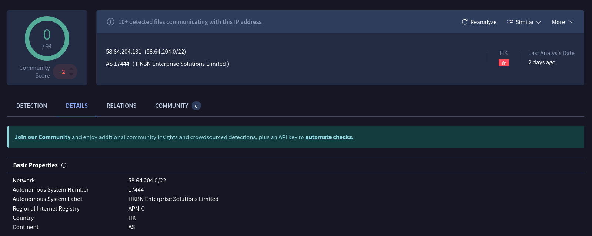

# [Ramnit](https://cyberdefenders.org/blueteam-ctf-challenges/ramnit/)

## Scenario

Our intrusion detection system has alerted us to suspicious behavior on a workstation, pointing to a likely malware intrusion. A memory dump of this system has been taken for analysis. Your task is to analyze this dump, trace the malware’s actions, and report key findings.

## Questions

1. What is the name of the process responsible for the suspicious activity?
1. What is the exact path of the executable for the malicious process?
1. Identifying network connections is crucial for understanding the malware's communication strategy. What IP address did the malware attempt to connect to?
1. To determine the specific geographical origin of the attack, Which city is associated with the IP address the malware communicated with?
1. Hashes serve as unique identifiers for files, assisting in the detection of similar threats across different machines. What is the SHA1 hash of the malware executable?
1. Examining the malware's development timeline can provide insights into its deployment. What is the compilation timestamp for the malware?
1. Identifying the domains associated with this malware is crucial for blocking future malicious communications and detecting any ongoing interactions with those domains within our network. Can you provide the domain connected to the malware?

## Analysis

We are provided with a `memory.dmp` file, with the size of 4.1G. 


By quickly running a `file` command on the file, we can get some basic information about the dump file.


```
memory.dmp: 
    MS Windows 64bit crash dump, 
    version 15.19041, 
    4 processors, 
    DumpType (0x1), 
    1048576 pages
```

We can also try to peak inside the file to check what it's made of. I chose to use a `hexdump` and then `strings` to get some more information about the file.


We can safely consider this a 64-bit Windows pagefile. Next what we are going to do is to use a popular digital forensic tool called **Volatility**.


First, what want to do is get basic information of this Windows pagefile. We will use `windows.info` plugin.

```
$ vol -f memory.dmp windows.info

┌──(venv)─(cyberseclabunix㉿cyberseclabunix)-[~/volatility3]
└─$ vol -f memory.dmp windows.info     
Volatility 3 Framework 2.26.2
Progress:  100.00               PDB scanning finished                                
Variable        Value

Kernel Base     0xf80049400000
DTB     0x1ad000
Symbols file:///home/cyberseclabunix/volatility3/volatility3/symbols/windows/ntkrnlmp.pdb/68A17FAF3012B7846079AEECDBE0A583-1.json.xz
Is64Bit True
IsPAE   False
layer_name      0 WindowsIntel32e
memory_layer    1 WindowsCrashDump64Layer
base_layer      2 FileLayer
KdDebuggerDataBlock     0xf8004a000b20
NTBuildLab      19041.1.amd64fre.vb_release.1912
CSDVersion      0
KdVersionBlock  0xf8004a00f398
Major/Minor     15.19041
MachineType     34404
KeNumberProcessors      4
SystemTime      2024-02-01 19:54:11+00:00
NtSystemRoot    C:\Windows
NtProductType   NtProductWinNt
NtMajorVersion  10
NtMinorVersion  0
PE MajorOperatingSystemVersion  10
PE MinorOperatingSystemVersion  0
PE Machine      34404
PE TimeDateStamp        Wed Jun 28 04:14:26 1995
```

This dump file is from a Windows 10 (x64) desktop/server. 

What I like to do first when analyzing Windows 10 is to look at the active connections. We can achive this by using `vol -f memory.dmp windows.netstat`. I would recommend to always save the output to a file, for convenience.

I'm looking for something that stands out (i.e. uncommon port). And we already got something interesting.


A ChromeSetup.exe (4628) is trying to connect to 58.64.204.181 via 5202/tcp. Let's check the reputation of this address.

.

I expected this address to belong to Google's address space, but Virustotal says otherwise. We have the answer to our first question. 

> What is the name of the process responsible for the suspicious activity? &rarr;
> **ChromeSetup.exe**

Now we can check the process tree of this suspicious process by using `vol -f input/memory.dmp windows.pstree --pid 4628`.


We can also achieve this by using `windows.cmdline` plugin.


We've got the answer to our second question!

> What is the exact path of the executable for the malicious process? &rarr;
> **C:\Users\alex\Downloads\ChromeSetup.exe**

We can also answer the third and the fourth question.

> Identifying network connections is crucial for understanding the malware's communication strategy. What IP address did the malware attempt to connect to? &rarr;
> **58.64.204.181**

> To determine the specific geographical origin of the attack, Which city is associated with the IP address the malware communicated with? &rarr;
> **Hong Kong**

Now we would like to get the hash of the malicious file. First we need to fetch the handles of the process. We will use `windows.handles` and `windows.dumpfiles` Volatility plugins.


Executing `vol -f input/memory.dmp windows.dumpfiles --pid 4628` will carve out all files related to this process. We are looking for out `ChromeSetup.exe` files


I've renamed these files to `ChromeSetup.exe.img` and `ChromeSetup.exe.dat`. What we are interested in is the file with `.img` extension.

```
┌──(venv)─(cyberseclabunix㉿cyberseclabunix)-[~/Lab]
└─$ sha1sum Chrome*            
b9921cc2bfe3b43e457cdbc7d82b849c66f119cb  ChromeSetup.exe.dat
280c9d36039f9432433893dee6126d72b9112ad2  ChromeSetup.exe.img
```

The hash we are looking for is the second one: `280c9d36039f9432433893dee6126d72b9112ad2`.
This is our answer to the fifth question

> Hashes serve as unique identifiers for files, assisting in the detection of similar threats across different machines. What is the SHA1 hash of the malware executable? &rarr;
> **280c9d36039f9432433893dee6126d72b9112ad2**

We can look it up in VirusTotal to verify this is it.


I always like to look at other reports, which you can find in **Behavior** tab > **Full reports** and select whichever you'd like. I went with Zenbox.

The sixth question ask us to find out the compilation timestamp of the malicious binary file. We will use `objdump` for this task.

```
objdump -p ChromeSetup.exe.img | grep "Time/Date"

Time/Date               Sun Dec  1 09:36:04 2019
```

You can also achieve this using `rabin2`.
```
rabin2 -I ChromeSetup.exe.img | grep "timestamp"
```

Now since my lab is in +0100 timezone, I have to substract one hour to get the UTC time.

> Examining the malware's development timeline can provide insights into its deployment. What is the compilation timestamp for the malware? &rarr;
> **2019-12-01 08:36**

Getting the answer to the last question, we can simply look for domains in one of the Virustotal full reports I mentioned above. Looking at the [Zenbox report](https://vtbehaviour.commondatastorage.googleapis.com/1ac890f5fa78c857de42a112983357b0892537b73223d7ec1e1f43f8fc6b7496_Zenbox.html?GoogleAccessId=758681729565-rc7fgq07icj8c9dm2gi34a4cckv235v1@developer.gserviceaccount.com&Expires=1749399179&Signature=iRWWvTrwx2A9Plgs8sKGDAciR%2FBJIexakDdV5wjjH7mwLHUNqQ5Sq9fFwnmACmts8TBEQxspzIrjTvcXUCgRh3LQ6jtB77tgol56tTGohDYHE0gZrxf%2BeqZqKL%2FpWpDZLkDpgj2iFXPkRMBh5QhXDwA3yC%2FY1B2xkb%2FSBmfd3fKmfgD%2B71blMfcgrXPTeMFOBXk49P2uhjJsvLqebHzlnmgnsQUGbNoxA%2FOYiBjNlkY4Xkz7My2UwKmPLbTTRdKefxHtiito0dlyXecyuFjlW38Ke0hOHwYFXdLZEUh%2Fai1L4MxAiCbhc0Q6VTcUQaeXhE4TJuSAW5YTNeUudBeTSQ%3D%3D&response-content-type=text%2Fhtml;#overview), we can find one domain.


> Identifying the domains associated with this malware is crucial for blocking future malicious communications and detecting any ongoing interactions with those domains within our network. Can you provide the domain connected to the malware? &rarr;
> **dnsnb8.net**


## Answers

1. What is the name of the process responsible for the suspicious activity?
    > ChromeSetup.exe
1. What is the exact path of the executable for the malicious process?
    > C:\Users\alex\Downloads\ChromeSetup.exe
1. Identifying network connections is crucial for understanding the malware's communication strategy. What IP address did the malware attempt to connect to?
    > 58.64.204.181
1. To determine the specific geographical origin of the attack, Which city is associated with the IP address the malware communicated with?
    > Hong Kong
1. Hashes serve as unique identifiers for files, assisting in the detection of similar threats across different machines. What is the SHA1 hash of the malware executable?
    > 280c9d36039f9432433893dee6126d72b9112ad2
1. Examining the malware's development timeline can provide insights into its deployment. What is the compilation timestamp for the malware?
    > 2019-12-01 08:36
1. Identifying the domains associated with this malware is crucial for blocking future malicious communications and detecting any ongoing interactions with those domains within our network. Can you provide the domain connected to the malware?
    > dnsnb8.net

## Resources used

* <https://www.speedguide.net/port.php?port=5202>
* <https://www.youtube.com/watch?v=Uk3DEgY5Ue8>
* <https://www.google.com/search?client=firefox-b-e&channel=entpr&q=%2258.64.204.181%22>
* <https://www.virustotal.com/gui/ip-address/58.64.204.181>
* <https://www.virustotal.com/gui/file/1ac890f5fa78c857de42a112983357b0892537b73223d7ec1e1f43f8fc6b7496/behavior>
* <https://vtbehaviour.commondatastorage.googleapis.com/1ac890f5fa78c857de42a112983357b0892537b73223d7ec1e1f43f8fc6b7496_CAPE%20Sandbox.html?GoogleAccessId=758681729565-rc7fgq07icj8c9dm2gi34a4cckv235v1@developer.gserviceaccount.com&Expires=1749399369&Signature=GbFtNl8dtx2Ur9onw3wBZNKbx59QTWuVHiwtuLLUiu9so%2FPmeJgSC8AlUmCh9cvdcUen%2FYodq5lIN0djnsBZvfZZioudKV50xVOMrLwMYh%2B6CYt3I8GSOEsJ6dTGIb8Ic8T%2F13O9nkDshNdAgswqoxFWtmloh6CSOcRjCFyQbfcJ2pPUDzVMEeD7ROsFx3WqFayGYobXanUoKbRn87hyPzDN04L2t71je%2FBbSE772UO9LZoaoPTkJnsPP%2BLub431NMZkvZrwHC0dtmKhqrVILSgktxTjaicP5RlcTGKDDGYMLXiSMuB10nXYPrgyneWuOly43H6%2B1xSgXgcuoaBtzA%3D%3D&response-content-type=text%2Fhtml;#behavior>
* <https://vtbehaviour.commondatastorage.googleapis.com/1ac890f5fa78c857de42a112983357b0892537b73223d7ec1e1f43f8fc6b7496_Zenbox.html?GoogleAccessId=758681729565-rc7fgq07icj8c9dm2gi34a4cckv235v1@developer.gserviceaccount.com&Expires=1749399179&Signature=iRWWvTrwx2A9Plgs8sKGDAciR%2FBJIexakDdV5wjjH7mwLHUNqQ5Sq9fFwnmACmts8TBEQxspzIrjTvcXUCgRh3LQ6jtB77tgol56tTGohDYHE0gZrxf%2BeqZqKL%2FpWpDZLkDpgj2iFXPkRMBh5QhXDwA3yC%2FY1B2xkb%2FSBmfd3fKmfgD%2B71blMfcgrXPTeMFOBXk49P2uhjJsvLqebHzlnmgnsQUGbNoxA%2FOYiBjNlkY4Xkz7My2UwKmPLbTTRdKefxHtiito0dlyXecyuFjlW38Ke0hOHwYFXdLZEUh%2Fai1L4MxAiCbhc0Q6VTcUQaeXhE4TJuSAW5YTNeUudBeTSQ%3D%3D&response-content-type=text%2Fhtml;#overview>
