# [XWorm](https://cyberdefenders.org/blueteam-ctf-challenges/xworm/)

## Scenario

Analyze malware behavior to identify persistence methods, evasion techniques, and C2 infrastructure by extracting artifacts and configuration data from static and dynamic analysis.

An employee accidentally downloaded a suspicious file from a phishing email. The file executed silently, triggering unusual system behavior. As a malware analyst, your task is to analyze the sample to uncover its behavior, persistence mechanisms, communication with Command and Control (C2) servers, and potential data exfiltration or system compromise.

## Questions

1. [What is the compile timestamp (UTC) of the sample?](#1-what-is-the-compile-timestamp-utc-of-the-sample)
2. [Which legitimate company does the malware impersonate in an attempt to appear trustworthy?](#2-which-legitimate-company-does-the-malware-impersonate-in-an-attempt-to-appear-trustworthy)
3. [How many anti-analysis checks does the malware perform to detect/evade sandboxes and debugging environments?](#3-how-many-anti-analysis-checks-does-the-malware-perform-to-detectevade-sandboxes-and-debugging-environments)
4. [What is the name of the scheduled task created by the malware to achieve execution with elevated privileges?](#4-what-is-the-name-of-the-scheduled-task-created-by-the-malware-to-achieve-execution-with-elevated-privileges)
5. [What is the filename of the malware binary that is dropped in the AppData directory?](#5-what-is-the-filename-of-the-malware-binary-that-is-dropped-in-the-appdata-directory)
6. [Which cryptographic algorithm does the malware use to encrypt or obfuscate its configuration data?](#6-which-cryptographic-algorithm-does-the-malware-use-to-encrypt-or-obfuscate-its-configuration-data)
7. [To derive the parameters for its encryption algorithm (such as the key and initialization vector), the malware uses a hardcoded string as input. What is the value of this hardcoded string?](#7-to-derive-the-parameters-for-its-encryption-algorithm-such-as-the-key-and-initialization-vector-the-malware-uses-a-hardcoded-string-as-input-what-is-the-value-of-this-hardcoded-string)
8. [What are the Command and Control (C2) IP addresses obtained after the malware decrypts them?](#8-what-are-the-command-and-control-c2-ip-addresses-obtained-after-the-malware-decrypts-them)
9. [What port number does the malware use for communication with its Command and Control (C2) server?](#9-what-port-number-does-the-malware-use-for-communication-with-its-command-and-control-c2-server)
10. [The malware spreads by copying itself to every connected removable device. What is the name of the new copy created on each infected device?](#10-the-malware-spreads-by-copying-itself-to-every-connected-removable-device-what-is-the-name-of-the-new-copy-created-on-each-infected-device)
11. [To ensure its execution, the malware creates specific types of files. What is the file extension of these created files?](#11-to-ensure-its-execution-the-malware-creates-specific-types-of-files-what-is-the-file-extension-of-these-created-files)
12. [What is the name of the DLL the malware uses to detect if it is running in a sandbox environment?](#12-what-is-the-name-of-the-dll-the-malware-uses-to-detect-if-it-is-running-in-a-sandbox-environment)
13. [What is the name of the registry key manipulated by the malware to control the visibility of hidden items in Windows Explorer?](#13-what-is-the-name-of-the-registry-key-manipulated-by-the-malware-to-control-the-visibility-of-hidden-items-in-windows-explorer)
14. [Which API does the malware use to mark its process as critical in order to prevent termination or interference?](#14-which-api-does-the-malware-use-to-mark-its-process-as-critical-in-order-to-prevent-termination-or-interference)
15. [Which API does the malware use to insert keyboard hooks into running processes in order to monitor or capture user input?](#15-which-api-does-the-malware-use-to-insert-keyboard-hooks-into-running-processes-in-order-to-monitor-or-capture-user-input)
16. [Given the malware'™s ability to insert keyboard hooks into running processes, what is its primary functionality or objective?](#16-given-the-malwares-ability-to-insert-keyboard-hooks-into-running-processes-what-is-its-primary-functionality-or-objective)

## Analysis

We are provided with a malware sample file. What I always like to do first is to do an `ls`, `file` and `sha256sum` on the file.

```sh
$ ls -l
-rw-rw-r-- 1 cyberseclabunix cyberseclabunix 87553 Apr 30 10:39 XWorm.malware

$ file XWorm.malware      
XWorm.malware: PE32 executable (GUI) Intel 80386 Mono/.Net assembly, for MS Windows, 3 sections

$ sha256sum XWorm.malware                     
ced525930c76834184b4e194077c8c4e7342b3323544365b714943519a0f92af  XWorm.malware
```

We have a `ced525930c76834184b4e194077c8c4e7342b3323544365b714943519a0f92af` file that is a PE32 executable, has 3 sections and there are mentions of .Net assembly.

We are encouraged to use couple of tools, like: Detect It Easy, CFF Explorer, PEStudio, dnSpy, ProcMon, RegShot, Python3. We can also use online sandboxes and static analyzers.

Let's get on with the questions.

### 1. What is the compile timestamp (UTC) of the sample?

The compliation timestamp we can easily get from VirusTotal, it is 2024-02-25 22:53:40 UTC.

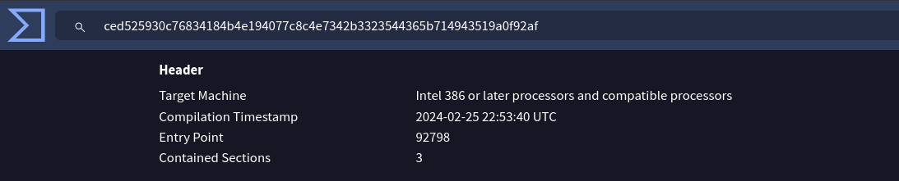

### 2. Which legitimate company does the malware impersonate in an attempt to appear trustworthy?

Since we are encouraged to use different tools, I will now use Detect-it-easy to find metadata about the executable.

Going into **PE options**, then **Resources** > **Version** we can get the metadata and the company name we are asked about.

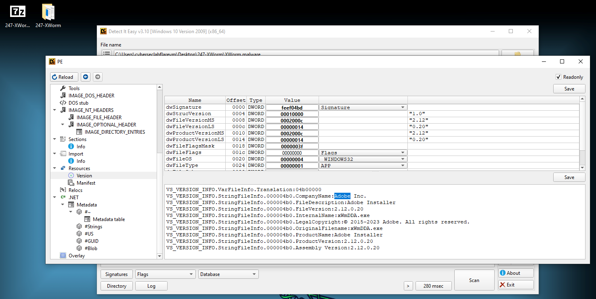

### 3. How many anti-analysis checks does the malware perform to detect/evade sandboxes and debugging environments?

To get the count of anti-analysis checks I went to https://www.filescan.io/uploads/68cef1f5254431b688d6e38d/reports/e5c7dee4-9783-4868-add7-0e8490f772e9/threat_indicators to get information about behaviours pointing to anti-analysis logic.

I found the following behaviours regarding anti-analysis:
* Found a WMI query string artifact often used for virtual machine detection or fingerprinting
* Found a WMI query string artifact often used to check if Antivirus or Firewall program is installed
* Found a string artifact often related to specific virtual machine detection
* .NET PE imports functions to access or modify environment variables

The answer 4 is not correct. So I decided to use Detect-it-easy and see what that will do.

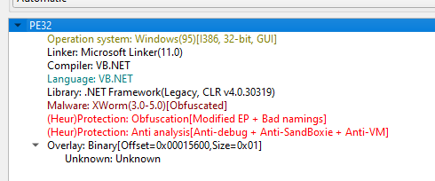

There are five items: 
* Obfuscation: Modified EP
* Obfuscation: Bad namings
* Anti analysis: Anti-debug
* Anti analysis: Anti-SandBoxie
* Anti analysis: Anti-VM

Five is the correct answer. There also was a behaviour found in FileScan that would also point to anti-analysis efforts: ".NET contains obfuscated method names". That would also give 5.

### 4. What is the name of the scheduled task created by the malware to achieve execution with elevated privileges?

I would need a process tree from a sandbox analysis environment. AnyRun is a great tool for that kind of task. I quickly found the sandbox report using malware's SHA256 hash.

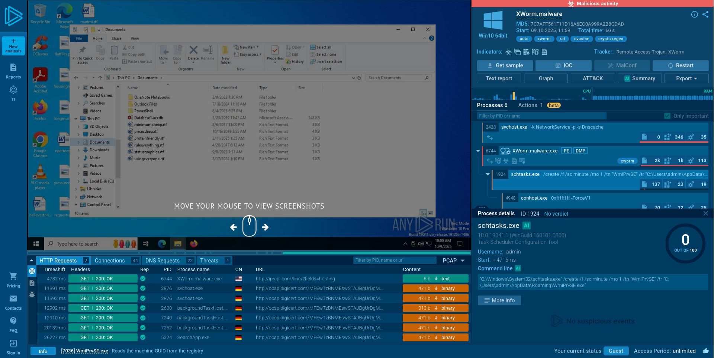

Here in the panel on the right we can see the `schtasks.exe` threat ran by `XWorm.Malware.exe` process.

The command line is as follows:

```powershell
"C:\Windows\System32\schtasks.exe" /create /f /sc minute /mo 1 /tn "WmiPrvSE" /tr "C:\Users\admin\AppData\Roaming\WmiPrvSE.exe" 
```

The `/tn` denotes the Task Name parameter. The name of the scheduled task is `WmiPrvSE`.

### 5. What is the filename of the malware binary that is dropped in the AppData directory?

In the lower panel we can find a little File tab icon. That tab contain all actions performed on files. We can see the filename of the malware binary that has been dropped in the AppData directory.

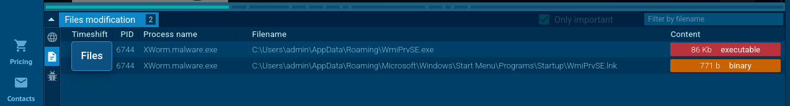

Is is `WmiPrvSE.exe`.

### 6. Which cryptographic algorithm does the malware use to encrypt or obfuscate its configuration data?

Here I was getting lost a bit, but I went back to FileScan to try to find the answer to that question.

I've analyzed the `memberRefNamesWithNamespace` tab in https://www.filescan.io/uploads/68cef1f5254431b688d6e38d/reports/e5c7dee4-9783-4868-add7-0e8490f772e9/details.

There was mentions of I guest .NET classes used by the malware. And among them were System.Secuirty classes:
```
...
System.Security.Cryptography.HashAlgorithm::ComputeHash
System.Security.Cryptography.ICryptoTransform::TransformFinalBlock
System.Security.Cryptography.MD5CryptoServiceProvider::ctor
System.Security.Cryptography.RijndaelManaged::ctor
System.Security.Cryptography.SymmetricAlgorithm::CreateDecryptor
System.Security.Cryptography.SymmetricAlgorithm::CreateEncryptor
System.Security.Cryptography.SymmetricAlgorithm::set_Key
System.Security.Cryptography.SymmetricAlgorithm::set_Mode
...
```

Now I know that Rijndael is an algorithm and `RijndaelManaged` is a algorithm class (according to [Microsoft's .NET documentation]()). And I remember that the Rijndael is also [an another name for AES](https://en.wikipedia.org/wiki/Advanced_Encryption_Standard).

So I provided the answer `AES` and it was correct.

---

This is where I decided to get familiar with dnSpy. I had to learn about how .NET executables work, how to decompile and debug them. There is a lot of good material on the internet. All of the resources I used to learn are mentioned at the end of the writeup. 

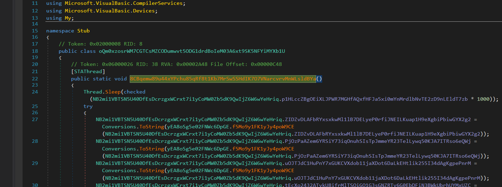

Looking at the sample directly in dnSpy I noticed that the bytecode is obfuscated in some way. However the logic is somewhat visible throughout the main class. 

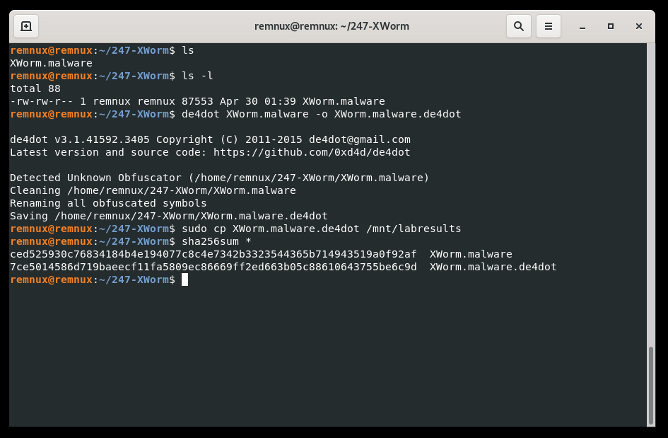

Using `de4dot` didn't do much in deobfuscating, so then I used SimpleAssemblyExplorer to try to deobfuscate the names, flow and strings to make things simpler. 

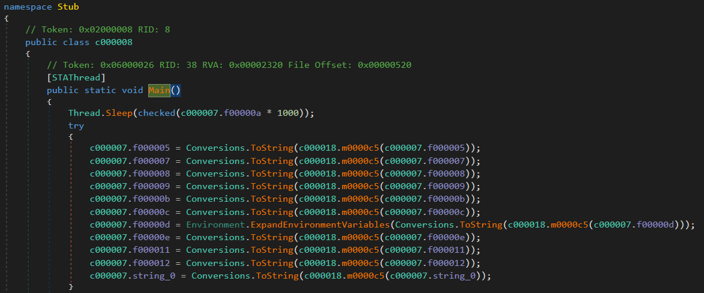

Now the code is more readable.

---

### 7. To derive the parameters for its encryption algorithm (such as the key and initialization vector), the malware uses a hardcoded string as input. What is the value of this hardcoded string?

I'm interested in the first set of instructions especialy what the first invoked method after main is doing, which is `m000c5()`.

```c#
c000007.f000005 = Conversions.ToString(c000018.m0000c5(c000007.f000005));
```

The method seems to be designed to decrypt data that is passed as a parameter:

```c#
public static object m0000c5(string string_0)
{
    RijndaelManaged rijndaelManaged = new RijndaelManaged();
    MD5CryptoServiceProvider md5CryptoServiceProvider = new MD5CryptoServiceProvider();
    byte[] array = new byte[32];
    byte[] array2 = md5CryptoServiceProvider.ComputeHash(c000019.wVkaAAeCf6BeWi8Flwtq(c000007.f00000f));
    Array.Copy(array2, 0, array, 0, 16);
    Array.Copy(array2, 0, array, 15, 16);
    rijndaelManaged.Key = array;
    rijndaelManaged.Mode = CipherMode.ECB;
    ICryptoTransform cryptoTransform = rijndaelManaged.CreateDecryptor();
    byte[] array3 = Convert.FromBase64String(string_0);
    return c000019.m0000cf(cryptoTransform.TransformFinalBlock(array3, 0, array3.Length));
}
```

After brief analysis, that the key is fetched from `f00000f` variable by the `wVkaAAeCf6BeWi8Flwtq()` method.

Navigating to this method, we can see that `f00000f` is a hardcoded string used in determining the key.

The string is:
```c#
// Token: 0x04000010 RID: 16
public static string f00000f = "8xTJ0EKPuiQsJVaT";
```

Which is the answer to question 7. 

### 8. What are the Command and Control (C2) IP addresses obtained after the malware decrypts them?

Now I know the first set of instructions contain encrypted data crucial for this malware to work. So it's probably konfiguration data.

The way that we get extract this data is simply to set breakpoints for each instruction and see what values are returned.

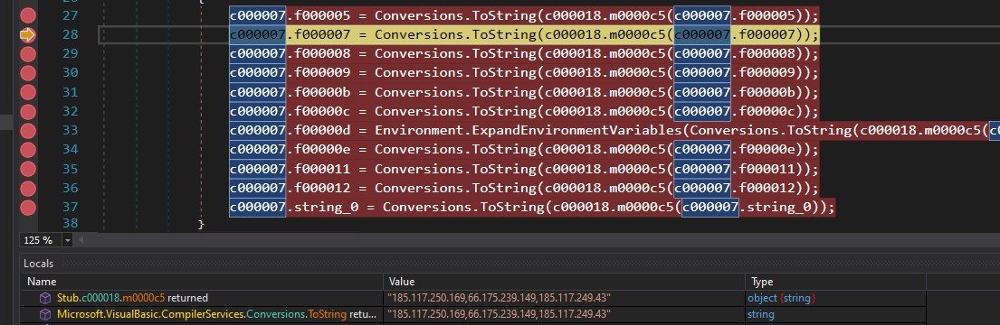

The method `m0000c5()` returned values `185.117.250.169, 66.175.239.149, 185.117.249.43`. This is the answer to question 8.

Seeing what values are returned we can start to rename some classes and variable names to facilitate further analysis.

### 9. What port number does the malware use for communication with its Command and Control (C2) server?

Next value returned by the second instruction in the set, is `7000`. But I'm not sure if it's actually a port number. So I renamed the variable to `MaybePortNumber` (as well as the next variables).

Going through each class we can kind of estimate what each class is responsible in the program. I've found a method which I called `MakeConnectionToC2()` that uses `MaybePortNumber` as a parameter to a `Socket.Connect()`. This is our port number.

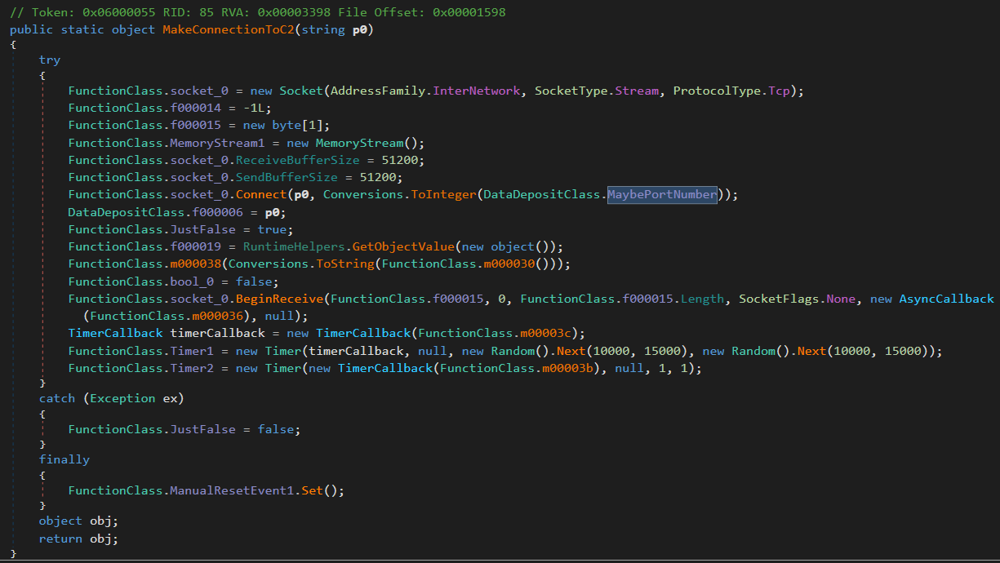

### 10. The malware spreads by copying itself to every connected removable device. What is the name of the new copy created on each infected device?

I've enumerated a `PersistanceClass` and a method `EnsurePersistanceViaUSBandLNK()`. In the code there is logic that creates a file on each removable device called `USB.exe`

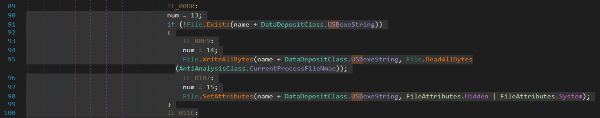

`USB.exe` is the answer.

### 11. To ensure its execution, the malware creates specific types of files. What is the file extension of these created files?

Later in the same method there are instructions that create `.lnk` files pointing to the malware to ensure exeuction.

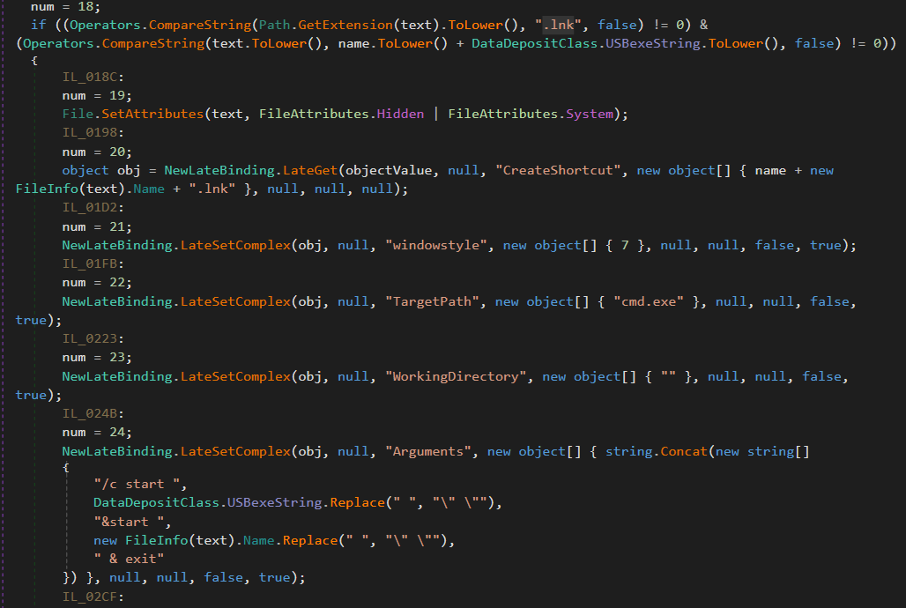

### 12. What is the name of the DLL the malware uses to detect if it is running in a sandbox environment?

There is a function that checks for `SbieDll.dll`, and sets a flag if it detects if that DLL file exists. `SbieDll.dll` is uses by Sandboxie, a sandbox-based isolation software for 32- and 64-bit Windows NT-based operating systems.

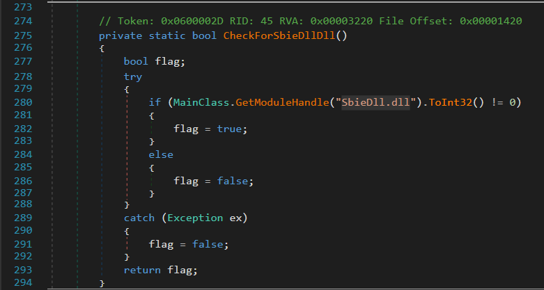

### 13. What is the name of the registry key manipulated by the malware to control the visibility of hidden items in Windows Explorer?

Back in the `PersistanceClass` there are instructions which check for 

```c#
RegistryKey registryKey = c000004.Computer.Registry.CurrentUser.OpenSubKey("Software\\Microsoft\\Windows\\CurrentVersion\\Explorer\\Advanced", true);
IL_0054:
num = 6;
if (Operators.ConditionalCompareObjectEqual(registryKey.GetValue("ShowSuperHidden"), 1, false))
{
    IL_0073:
    num = 7;
    registryKey.SetValue("ShowSuperHidden", 0);
}
```

The name of the registry key manipulated by the malware to control the visibility of hidden items is `ShowSuperHidden`.

### 14. Which API does the malware use to mark its process as critical in order to prevent termination or interference?

In `CriticalProcessClass` there is mention of accessing `RtlSetProcessIsCritical` Win32 API.

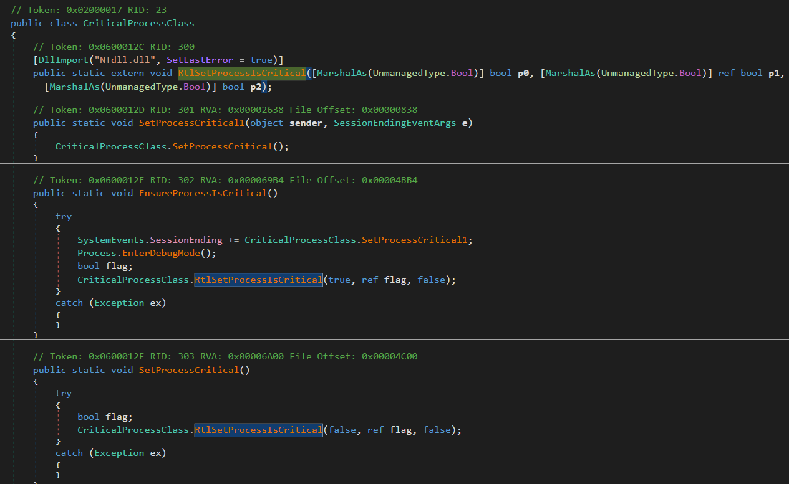

### 15. Which API does the malware use to insert keyboard hooks into running processes in order to monitor or capture user input?

In `KeyloggerClass` there is mention of accessing the `SetWindowsHookEx` Win32 API.

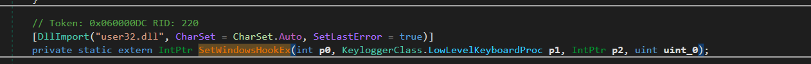

### 16. Given the malware'™s ability to insert keyboard hooks into running processes, what is its primary functionality or objective?

It's usualy the goal of a Keylogger to insert keyboard hooks in to running processes.

## Answers

1. What is the compile timestamp (UTC) of the sample?
> `2024-02-25 22:53`
2. Which legitimate company does the malware impersonate in an attempt to appear trustworthy?
> `Adobe`
3. How many anti-analysis checks does the malware perform to detect/evade sandboxes and debugging environments?
> `5`
4. What is the name of the scheduled task created by the malware to achieve execution with elevated privileges?
> `WmiPrvSE`
5. What is the filename of the malware binary that is dropped in the AppData directory?
> `WmiPrvSE.exe`
6. Which cryptographic algorithm does the malware use to encrypt or obfuscate its configuration data?
> `AES`
7. To derive the parameters for its encryption algorithm (such as the key and initialization vector), the malware uses a hardcoded string as input. What is the value of this hardcoded string?
> `8xTJ0EKPuiQsJVaT`
8. What are the Command and Control (C2) IP addresses obtained after the malware decrypts them?
> `185.117.250.169, 66.175.239.149, 185.117.249.43`
9. What port number does the malware use for communication with its Command and Control (C2) server?
> `7000`
10. The malware spreads by copying itself to every connected removable device. What is the name of the new copy created on each infected device?
> `usb.exe`
11. To ensure its execution, the malware creates specific types of files. What is the file extension of these created files?
> `lnk`
12. What is the name of the DLL the malware uses to detect if it is running in a sandbox environment?
> `SbieDll.dll`
13. What is the name of the registry key manipulated by the malware to control the visibility of hidden items in Windows Explorer?
> `ShowSuperHidden`
14. Which API does the malware use to mark its process as critical in order to prevent termination or interference?
> `RtlSetProcessIsCritical`
15. Which API does the malware use to insert keyboard hooks into running processes in order to monitor or capture user input?
> `SetWindowsHookEx`
16. Given the malware'™s ability to insert keyboard hooks into running processes, what is its primary functionality or objective?
> `Keylogger`


## Resources used

- `remnux` and `flarevm`
- https://app.any.run/
- https://www.virustotal.com/
- https://filescan.io/
- https://www.youtube.com/@jstrosch
- https://www.youtube.com/watch?v=LCxdCn9exbQ
- https://www.youtube.com/watch?v=vpdiO44Gsw8
- https://www.youtube.com/watch?v=80MzgB0lnjM
- https://github.com/de4dot/de4dot (available in `remnux`)
- https://github.com/wickyhu/simple-assembly-explorer/releases
- https://github.com/dnSpy/dnSpy (available in `flarevm`)